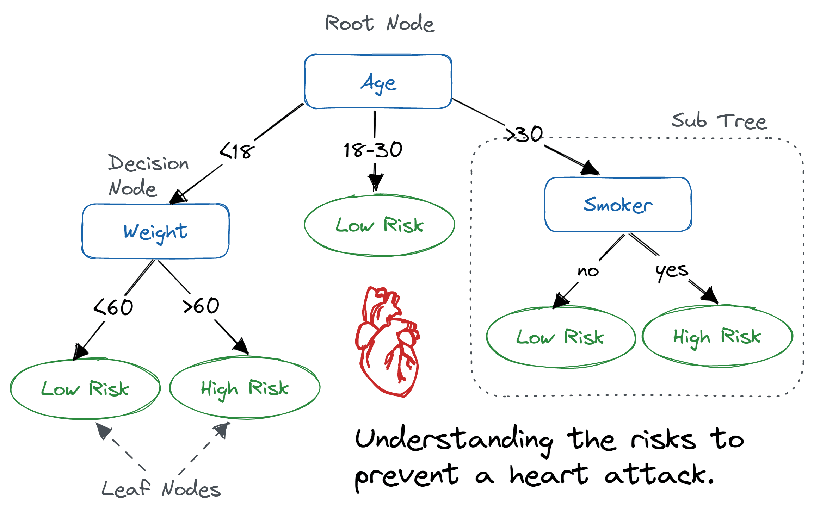

# 📘 Decision-Tree

## 📖 Definition
- A decision tree is a flowchart-like tree structure where an internal node represents a feature(or attribute), the branch represents a decision rule, and each leaf node represents the outcome.

- The topmost node in a decision tree is known as the root node. It learns to partition on the basis of the attribute value. It partitions the tree in a recursive manner called recursive partitioning. This flowchart-like structure helps you in decision-making. It's visualization like a flowchart diagram which easily mimics the human level thinking. That is why decision trees are easy to understand and interpret.

ref: datacamp.com

---

## 🔑 Key Concepts

---

## 🛠️ Hands-on Implementation
👉 Check the notebook: [decision_tree.ipynb](./decision_tree.ipynb)

---